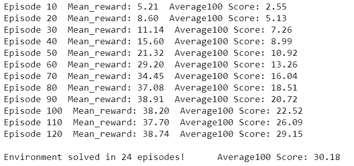

# Report of Udacity Deep Reinforcement Learning Nanodegree Project 2: Continuous Control

This is my report for [Udacity Deep Reinforcement Learning Nanodegree](https://www.udacity.com/course/deep-reinforcement-learning-nanodegree--nd893) Project 2: Continuous Control.

## Project's goal

In this environment, a double-jointed arm can move to target locations. A reward of +0.1 is provided for each step that the agent's hand is in the goal location. Thus, the goal of the agent is to maintain its position at the target location for as many time steps as possible.


### Environment details

The environment is based on [Unity ML-agents](https://github.com/Unity-Technologies/ml-agents). Unity ML-Agents is an open-source Unity plugin that enables games and simulations to serve as environments for training intelligent agents.

**Note:** The Unity ML-Agent team frequently releases updated versions of their environment. We are using the v0.4 interface. The project environment provided by Udacity is similar to, but not identical to the [Reacher](https://github.com/Unity-Technologies/ml-agents/blob/master/docs/Learning-Environment-Examples.md#reacher) environment on the Unity ML-Agents GitHub page.

The observation space consists of 33 variables corresponding to position, rotation, velocity, and angular velocities of the arm. Each action is a vector with four numbers, corresponding to torque applicable to two joints. Every entry in the action vector should be a number between -1 and 1.

- Set-up: Double-jointed arm which can move to target locations.
- Goal: The agents must move it's hand to the goal location, and keep it there.
- Agents: The environment contains 10 agent with same Behavior Parameters. (The provided Udacity agent versions are Single Agent or 20 Agents.)
- Agent Reward Function (independent):
  - +0.1 Each step agent's hand is in goal location.
- Behavior Parameters:
  - Vector Observation space: 26 variables corresponding to position, rotation, velocity, and angular velocities of the two arm Rigidbodies.
  - Vector Action space: (Continuous) Size of 4, corresponding to torque applicable to two joints.
  - Visual Observations: None.
- Benchmark Mean Reward: 30

For this project, Udacity provides two separate versions of the Unity environment:
- The first version contains a single agent.
- The second version contains 20 identical agents, each with its own copy of the environment.

### Solving the environment

Depending on the chosen environment, there are 2 options to solve the environment:

**Option 1: Solve the First Version**

The task is episodic, and in order to solve the environment, the agent must get an average score of +30 over 100 consecutive episodes. 

**Option 2: Solve the Second Version**

The barrier for solving the second version of the environment is slightly different, to take into account the presence of many agents. In particular, the agents must get an average score of +30 (over 100 consecutive episodes, and over all agents). Specifically:
    - After each episode, the rewards that each agent received (without discounting) are added up , to get a score for each agent. This yields 20 (potentially different) scores. The average of these 20 scores is then used.
    - This yields an average score for each episode (where the average is over all 20 agents).
The environment is considered solved, when the average (over 100 episodes) of those average scores is at least +30.

**In my implementation I have chosen to solve the Second version of the environment (20 Agents) using DDPG algorithm.** 

## Agent Implementation

### Deep Deterministic Policy Gradient (DDPG)

This project implements an *off-policy method* called **Deep Deterministic Policy Gradient** and described in the paper [Continuous control with deep reinforcement learning](https://arxiv.org/abs/1509.02971). 

Deep Deterministic Policy Gradient (DDPG) is an algorithm which concurrently learns a Q-function and a policy. It uses off-policy data and the Bellman equation to learn the Q-function, and uses the Q-function to learn the policy.

More explanation and details can be found in OpenAI's [Spinning Up](https://spinningup.openai.com/en/latest/algorithms/ddpg.html) website.

### Algorithm


This algorithm is taken from [DDPG algorithm from the Spinning Up website](https://spinningup.openai.com/en/latest/algorithms/ddpg.html).

### Code implementation

The codes consist of 3 files:

- `model.py` : Implement the **Actor** and the **Critic** class.
    - Both Actor and Critic class implement a *Target* and a *Local* Neural Network for training.
    
- `ddpg_agent.py` : Implement the DDPG agent, a Noise and a Replay Buffer class.
    - The Actor's *Local* and *Target* neural networks, and the Critic's *Local* and *Target* neural networks, the Noise process and the Replay Buffer are instanciated by the Agent's constructor.
    - The Noise uses Ornstein-Uhlenbeck process.
    - The Replay Buffer is a fixed-size buffer to store experience tuples.
  
- `Continuous_Control.ipynb` : In this Jupyter Notebook file, we can train the agent. More specifically, it is able to:
  - Import the necessary packages 
  - Check the state and action spaces
  - Take random actions in the environment
  - Train 20 agents using DDPG
  - Plot the scores/rewards

### Hyperparameters

The DDPG agent uses the following hyperparameters:

```
BUFFER_SIZE = int(1e6)  # replay buffer size
BATCH_SIZE = 128        # minibatch size
GAMMA = 0.99            # discount factor
TAU = 1e-3              # for soft update of target parameters
LR_ACTOR = 1e-4         # learning rate of the actor 
LR_CRITIC = 1e-3        # learning rate of the critic
WEIGHT_DECAY = 0        # L2 weight decay
LEARN_EVERY = 20        # update the networks 10 times after every 20 timesteps
LEARN_NUMBER = 10       # update the networks 10 times after every 20 timesteps
EPSILON = 1.0           # noise factor
EPSILON_DECAY = 0.999999  # noise factor decay

n_episodes=1000         # maximum number of episodes to train
max_t=1000              # maximum number of steps to train per episode
```

The **Actor Neural Networks** use the following architecture :

```
Input Layer (33) ->
Fully Connected Hidden Layer (400 nodes, Batch Normlization, relu activation) ->
Fully Connected Hidden Layer (300 nodes, relu activation) ->
Ouput Layer (4 nodes, tanh activation)
```


The **Critic Neural Networks** use the following architecture :

```
Input Layer (33) ->
Fully Connected Hidden Layer (400 nodes, Batch Normlization, relu activation) ->
Fully Connected Hidden Layer (300+4 nodes [including actions], relu activation) ->
Ouput Layer (1 node, no activation)
```

Some important changes:

- I add noise decay factor *EPSILON_DECAY* for the noise factor *EPSILON*.
- I use gradient clipping when training the critic network `clip_grad_norm_(self.critic_local.parameters(), 1)`.
- I update the actor and critic networks 10 times after every 20 timesteps.

## Results

With all these hyperparameters and Neural Networks, the result is quite good:




**The result satisfies the goal of this project as the average (over 100 episodes) of those average scores is at least +30, and in ??? episodes only**. 

## Ideas for future work

For the second version of the reacher environment, it might be better to use another algorithm like **D4PG** that use multiple (non-interacting, parallel) copies of the same agent to distribute the task of gathering experience.  

**Distributed Distributional Deterministic Policy Gradients** - [D4PG](https://openreview.net/pdf?id=SyZipzbCb)

> **Abstract**: This work adopts the very successful distributional perspective on reinforcement learning and adapts it to the continuous control setting. We combine this within a distributed framework for off-policy learning in order to develop what we call the Distributed Distributional Deep Deterministic Policy Gradient algorithm, D4PG. We also combine this technique with a number of additional, simple improvements such as the use of N-step returns and prioritized experience replay. Experimentally we examine the contribution of each of these individual components, and show how they interact, as well as their combined contributions. Our results show that across a wide variety of simple control tasks, difficult manipulation tasks, and a set of hard obstacle-based locomotion tasks the D4PG algorithm achieves state of the art performance.
